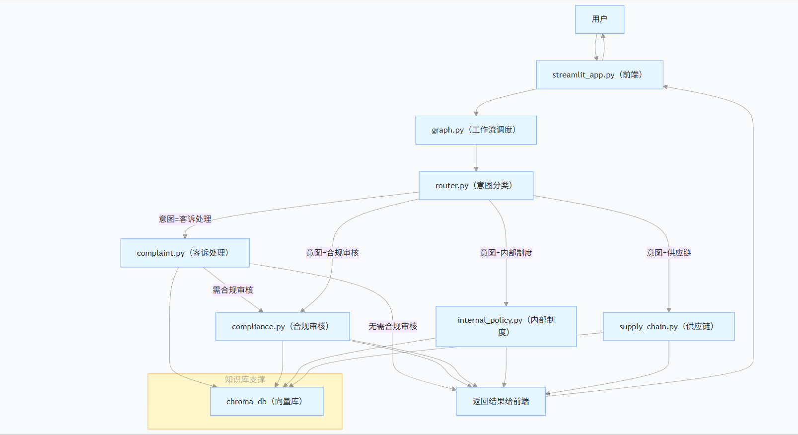
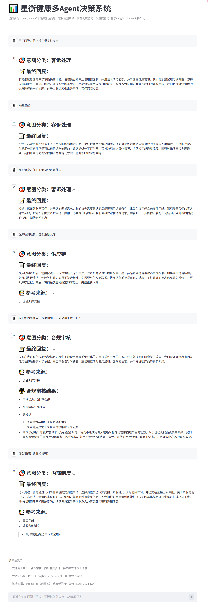

# 电商企业（星衡健康）多Agent知识决策系统  
**E-commerce Enterprise (Xingheng Health) Multi-Agent Knowledge Decision System**

**项目简介**  
**Project Introduction**  

一个面向电商企业（护肤品/健康消费品）的多Agent智能决策系统，支持四大核心场景：  
A multi-agent intelligent decision-making system designed for e-commerce enterprises (skincare/health consumer products), supporting four core scenarios:

- 客诉处理（过敏/退换货投诉自动回复 + 合规二次校验）  
  Customer Complaint Handling (automatic reply for allergy/return&exchange complaints + secondary compliance verification)

- 营销合规审核（宣传话术/海报文案实时合规检查 + 修改建议）  
  Marketing Compliance Review (real-time compliance check for promotional copy/poster text + modification suggestions)

- 内部制度咨询（请假/考勤/奖惩等流程查询）  
  Internal Policy Consultation (inquiries on leave/attendance/rewards & punishments processes)

- 供应链查询（产品规格/退货入库等）  
  Supply Chain Inquiry (product specifications/return warehousing, etc.)

**技术栈**  
**Tech Stack**  

- **核心编排**：LangGraph（状态图 + 条件路由）  
  **Core Orchestration**: LangGraph (State Graph + Conditional Routing)

- **知识底座**：Chroma 向量数据库 + RAG（Chroma + HuggingFaceEmbeddings）  
  **Knowledge Base**: Chroma Vector Database + RAG (Chroma + HuggingFaceEmbeddings)

- **大模型**：通义千问（DashScope API）  
  **LLM**: Tongyi Qianwen (DashScope API)

- **会话持久化**：Redis + RedisSaver（替换 MemorySaver，支持生产级状态持久化）  
  **Session Persistence**: Redis + RedisSaver (replaces MemorySaver, supports production-grade state persistence)

- **前端**：Streamlit（聊天界面 + 多会话管理）  
  **Frontend**: Streamlit (chat interface + multi-session management)

- **部署**：Docker + Docker Compose（一键容器化 Redis + App）  
  **Deployment**: Docker + Docker Compose (one-click containerization of Redis + App)

**项目亮点**  
**Project Highlights**  

- 意图路由 + 专用Agent架构，业务边界清晰，降低幻觉风险  
  Intent routing + dedicated Agent architecture, clear business boundaries, reduced hallucination risk

- 客诉场景强制二次合规校验（高危业务保护）  
  Mandatory secondary compliance verification in customer complaint scenarios (protection for high-risk business)

- Redis 持久化 checkpoint，实现多轮对话状态保存  
  Redis persistent checkpoint, enabling multi-turn conversation state preservation

- Docker Compose 一键部署，支持容器间通信和模块加载（RedisJSON + RediSearch）  
  Docker Compose one-click deployment, supports inter-container communication and module loading (RedisJSON + RediSearch)

**快速启动**  
**Quick Start**  

- 已安装并启动 Docker Desktop（Windows/Mac/Linux 均支持）  
  Docker Desktop is installed and running (supports Windows/Mac/Linux)

- 网络正常（能访问 Docker Hub 或已配置镜像加速器）  
  Network is normal (can access Docker Hub or has configured mirror accelerator)

1. 克隆仓库并进入项目目录  
   Clone the repository and enter the project directory**

   ```bash
   git clone https://github.com/junxiu1234/Multi-Agent-Knowledge-Decision-Making-System-for-E-commerce-Enterprises.git
   cd Multi-Agent-Knowledge-Decision-Making-System-for-E-commerce-Enterprises/code 

2. 运行：
   run:
   ```bash
   docker compose up -d --build
   
3. 如果build 卡在下载 python:3.11-slim，请先请先手动
   If build gets stuck downloading python:3.11-slim, please run first:
   ```bash
   docker pull python:3.11-slim

之后运行：
then run again:
   
   docker compose up -d --build  

4. 访问应用：
Access the application:

http://localhost:8501

5. 停止项目:
Stop the project:
    ```bash
   docker compose down
   
**系统架构图**

**功能展示**
   